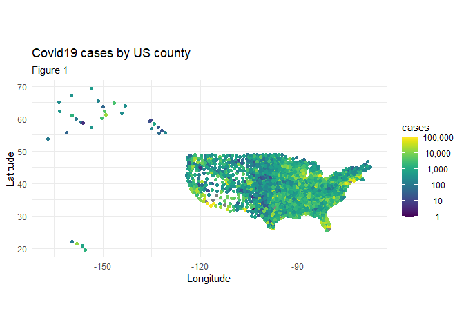
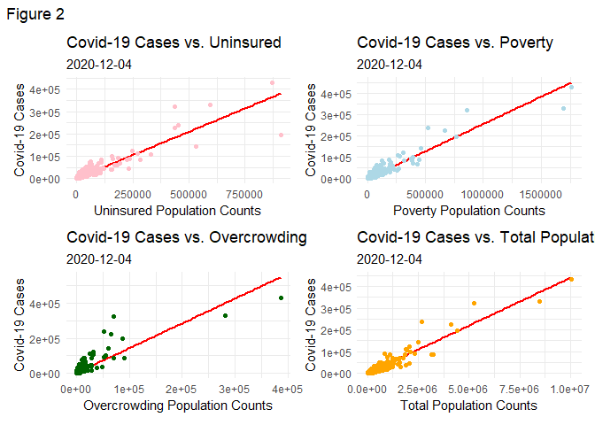
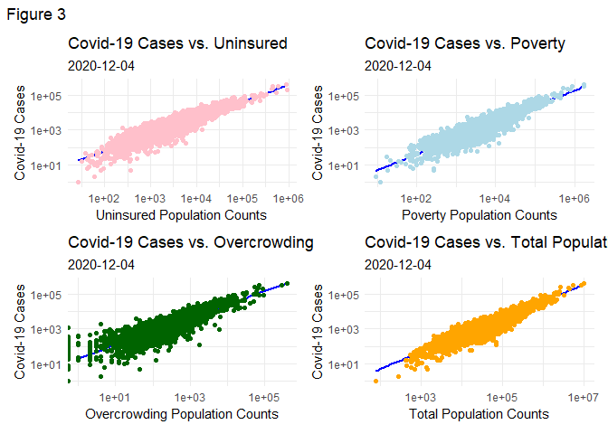
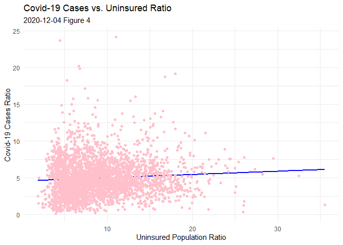
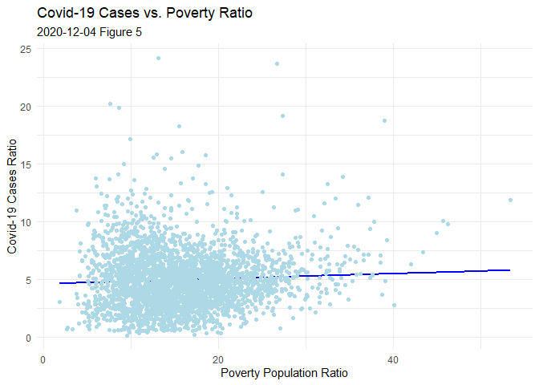
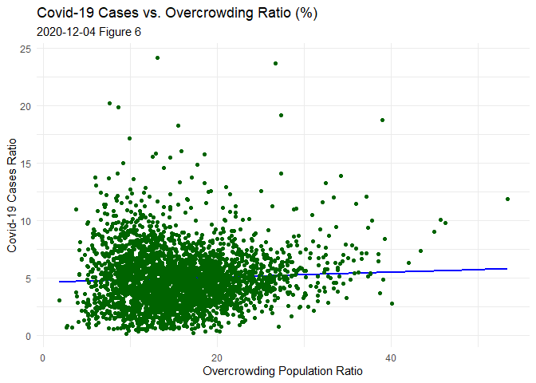

Socioeconomic Impacts of Covid-19 Cases in 2020 Final Report
================
Sirui Chu, Christine Hou, Gary Lin, Marissa Long
2022-12-11

Here is our github link: [github](https://github.com/G-rexy/433-Final)

# Introduction

In the year 2020, the year with several severe outbreaks of Covid-19,
lots of people were infected by Covid-19 and suffered from the disease.
The pandemic also affected world economics a lot due to the actions
taken and policies enforced by each country. Since these happened
simultaneously, our group would like to research if there is any
relationship between Covid-19 infection and economics; to make it more
applicable to research, our group decided to use socioeconomic status
predicted by multiple features and find the association between
population socioeconomic status and the Covid cases using counties of
the US as the unit of analysis.

Our group infers that the increasing Covid-19 cases in different
counties over the United States have positive associations with
socioeconomic status and housing conditions like percentage of people in
the overcrowded household, percentage of people in poverty, and
percentage of uninsured people in each county. For counties with higher
percentages of these variables of socioeconomic status and housing
conditions, they are more likely to have a larger percentages of number
of Covid-19 cases, and our group is concerned about whether there is a
way to identify vulnerable groups in the United States to better provide
additional assistance to these groups in order to improve the overall
well-beings of people in United States.

# Data

The data set we used is collected by John Davis on kaggle as a
combination of five data sets
([Kaggle](https://www.kaggle.com/code/johnjdavisiv/us-counties-weather-health-hospitals-Covid19-data/data)).
The first data set is collected by the New York Times that records the
country-level Covid-19 cases and its fatality. The second data set is
collected by CDC that includes the estimate and percentages of variables
that measure social vulnerability that includes socioeconomic, household
composition and disability, minority status and language, and housing /
transportation in 2016. The third data set collected by the County
Health Rankings website measures different variables for community
health like medical conditions and mortality rate for the year of 2020.
The fourth data set is collected by the National Oceanic and Atmospheric
Administration for the variables of daily weather conditions in 2020.
The fourth data set about the date of stay at home policy being
effective in each state is collected by Kaiser Family Foundation.

We first filter out a subset from the original data set with our
interested variables such as date, county, cases, population, and other
variables of social vulnerability. Then we decide to use the data
collected in the last day of the dataset since the original data set is
collected over an interval of time, and we are not exploring the effect
of time in this analysis, so that we only keep the observations that
were collected on December 4th, 2020. In order to make the dataset more
reasonable to be analyzed, we choose to use the ratio of the
populations, variables of socioeconomic status and housing conditions,
and Covid-19 cases in each county to avoid the potential effect that may
be caused by too large or too small counties which may become outliers.

This is an overview of the dataset after filtering:

    # A tibble: 6 × 9
      date       county  cases   lat   lon total_population num_be…¹ num_u…² num_o…³
      <date>     <chr>   <dbl> <dbl> <dbl>            <dbl>    <dbl>   <dbl>   <dbl>
    1 2020-12-04 Autauga  2945  32.5 -86.6            55049     6697    4093     254
    2 2020-12-04 Baldwin  9501  30.7 -87.7           199510    25551   19119     958
    3 2020-12-04 Barbour  1217  31.9 -85.4            26614     6235    2136     158
    4 2020-12-04 Bibb     1270  33.0 -87.1            22572     3390    1727      22
    5 2020-12-04 Blount   3231  34.0 -86.6            57704     9441    6333     391
    6 2020-12-04 Bullock   711  32.1 -85.7            10552     2728     803       6
    # … with abbreviated variable names ¹​num_below_poverty, ²​num_uninsured,
    #   ³​num_overcrowding

This is an overview of pre-processed dataset after curation:

    # A tibble: 6 × 7
      county    lat   lon cases_ratio below_poverty_ratio uninsured_ratio overcrow…¹
      <chr>   <dbl> <dbl>       <dbl>               <dbl>           <dbl>      <dbl>
    1 Autauga  32.5 -86.6        5.35                12.2            7.44       0.46
    2 Baldwin  30.7 -87.7        4.76                12.8            9.58       0.48
    3 Barbour  31.9 -85.4        4.57                23.4            8.03       0.59
    4 Bibb     33.0 -87.1        5.63                15.0            7.65       0.1 
    5 Blount   34.0 -86.6        5.6                 16.4           11.0        0.68
    6 Bullock  32.1 -85.7        6.74                25.8            7.61       0.06
    # … with abbreviated variable name ¹​overcrowding_ratio

The visualization of the map is to give an overview of the Covid cases
across the US. And there are some empty spots without datapoint are not
included in the CDC dataset which may be caused by some small counties
that are too small to have a medical agency to report the cases.

    ## Loading required package: viridisLite

    ## 
    ## Attaching package: 'cowplot'

    ## The following object is masked from 'package:lubridate':
    ## 
    ##     stamp

<!-- -->

# Methods

We used linear regression to fit the model and tried to find out the
association between socioeconomic status and number of Covid-19 cases in
each county in the United States. As all of the variables we are
interested in are numeric and we do not intend to make predictions, we
decided to use linear regression to fit every explanatory variable that
can predict socioeconomic status including ratio of overcrowding,
uninsured people, and people below poverty with ratio of Covid-19 cases.

According to the original linear association graphs, there are some fake
outliers which actually are not, so we are determined to use the log
ratio to scale the data and justify that the outliers that appeared
previously in the original linear association graphs are shown as
potential outliers because of its large population. Confounding
variables is another problem that needs to be addressed for the
analysis. And since the populations of different US counties are
different, we use ratio of the population and Covid-19 cases in each
county as our final variables for analysis to avoid the potential errors
caused by confounders.

This is the plot before log:

<!-- -->

This is the plot after log:

<!-- -->

# Results

After fitting linear regression, we find out that there’s a positive
association between all three explanatory variables (ratios of uninsured
people, people below poverty, and overcrowding) and ratio of number of
Covid-19 cases. Based on all three features are positively related to
the response variable, we are confidence that there is a positive
association between the socioeconomics status and the Covid-19 cases.

#### Uninsured People

    Call:
    lm(formula = cases_ratio ~ uninsured_ratio, data = data_ratio)

    Residuals:
        Min      1Q  Median      3Q     Max 
    -5.3640 -1.6615 -0.2566  1.2403 19.1451 

    Coefficients:
                    Estimate Std. Error t value Pr(>|t|)    
    (Intercept)      4.56806    0.10443  43.741  < 2e-16 ***
    uninsured_ratio  0.04417    0.01048   4.215 2.57e-05 ***
    ---
    Signif. codes:  0 '***' 0.001 '**' 0.01 '*' 0.05 '.' 0.1 ' ' 1

    Residual standard error: 2.467 on 3134 degrees of freedom
      (84 observations deleted due to missingness)
    Multiple R-squared:  0.005638,  Adjusted R-squared:  0.00532 
    F-statistic: 17.77 on 1 and 3134 DF,  p-value: 2.565e-05

<!-- -->

We find the positive association between ratio of Covid-19 cases and
ratio of uninsured people.

#### People Below Poverty

    Call:
    lm(formula = cases_ratio ~ below_poverty_ratio, data = data_ratio)

    Residuals:
        Min      1Q  Median      3Q     Max 
    -4.7484 -1.6505 -0.2685  1.2837 19.2921 

    Coefficients:
                        Estimate Std. Error t value Pr(>|t|)    
    (Intercept)          4.61895    0.12054  38.318  < 2e-16 ***
    below_poverty_ratio  0.02207    0.00711   3.104  0.00192 ** 
    ---
    Signif. codes:  0 '***' 0.001 '**' 0.01 '*' 0.05 '.' 0.1 ' ' 1

    Residual standard error: 2.47 on 3134 degrees of freedom
      (84 observations deleted due to missingness)
    Multiple R-squared:  0.003065,  Adjusted R-squared:  0.002747 
    F-statistic: 9.636 on 1 and 3134 DF,  p-value: 0.001925

<!-- -->

We find the positive association between ratio of Covid-19 cases and
ratio of people below poverty.

#### Overcrowding

    Call:
    lm(formula = cases_ratio ~ overcrowding_ratio, data = data_ratio)

    Residuals:
        Min      1Q  Median      3Q     Max 
    -5.3204 -1.6665 -0.2397  1.2641 19.4435 

    Coefficients:
                       Estimate Std. Error t value Pr(>|t|)    
    (Intercept)         4.74382    0.07145  66.395  < 2e-16 ***
    overcrowding_ratio  0.25389    0.06392   3.972 7.29e-05 ***
    ---
    Signif. codes:  0 '***' 0.001 '**' 0.01 '*' 0.05 '.' 0.1 ' ' 1

    Residual standard error: 2.468 on 3134 degrees of freedom
      (84 observations deleted due to missingness)
    Multiple R-squared:  0.005009,  Adjusted R-squared:  0.004691 
    F-statistic: 15.78 on 1 and 3134 DF,  p-value: 7.291e-05

<!-- -->

We find the positive association between ratio of Covid-19 cases and
ratio of ratio of overcrowding.

# Conclusion

Since all three features positively correlated with the response
variable, we can reasonably assume that there is an association between
socioeconomic status and the Covid-19 cases. Based on the summary data
of the models we fitted, we got all positive coefficients, which are
demonstrated in Figure 4, 5, and 6 we have in the result section, so we
would conclude that there is a positive association between
socioeconomic status and Covid-19 cases which follow our thesis
statement.

#### Limitation

One limitation of the data set is that not all counties are included in
it since the data set collected by New York Times only includes counties
that have at least one Covid-19 case. Another limitation is that the
variables we used for our project are not the exact number of variables
of interest in each county, instead, they are estimates of the
population. We are assuming the sample populations used by CDC are
proper representations of the county populations. Another potential
problem is that the number of Covid-19 cases might not be the precise
measurement of cases in each county if we take account of the cases like
people infected did not go to the hospital and therefore they are not
counted in the data set.

#### Further Study

For future study, we could try to find more data of Covid-19 cases of
years other than 2020, since as time goes by, more Covid-19 variants
have appeared and they might have different effects on different
vulnerable groups than the original Covid-19. It’s also possible for us
to find additional Covid-19 related data from other countries to further
study how the difference between countries might also have an effect on
ratios of Covid-19 cases in local populations. Furthermore, if given
more time, we could try to add the time as another variable to explore
the different rate of spread of Covid-19 among populations of different
US counties.
